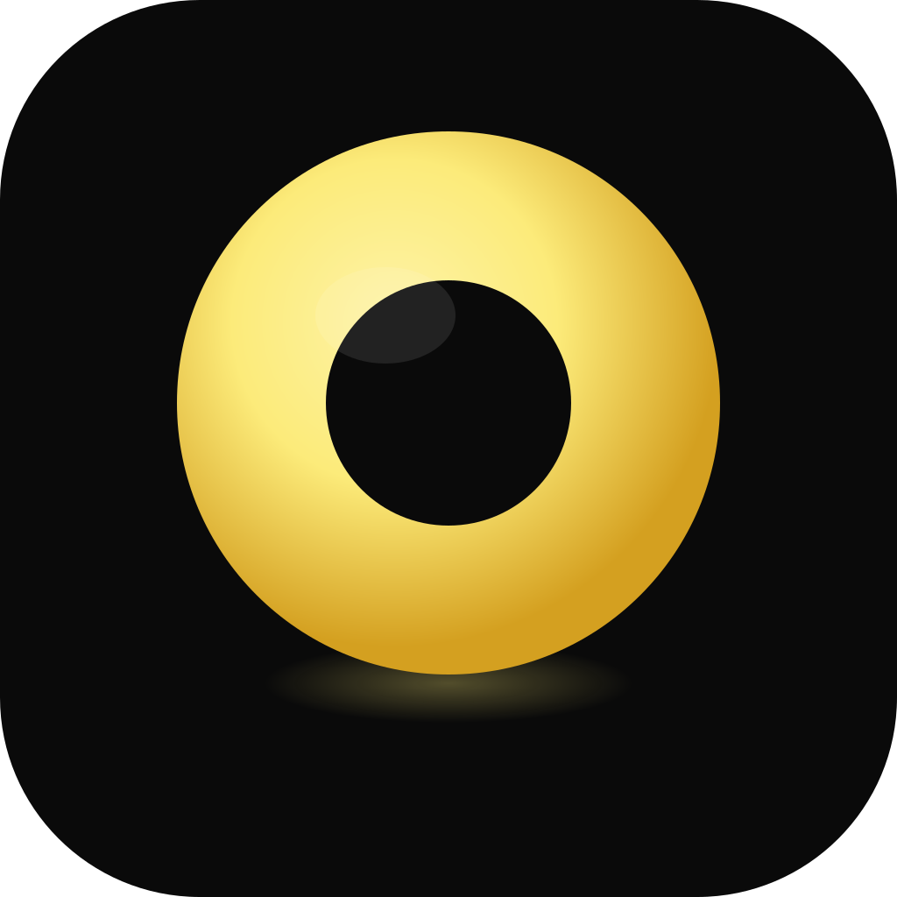

  

<h1 align="center">Floaty</h1>

  <strong>The Pomodoro Timer That Stays on Top</strong> 
  화면 위에 항상 떠 있는 뽀모도로 타이머

  
  
  

  <a href="https://kibanana.github.io/Floaty-landing-page/">Website</a> ·
  <a href="https://github.com/kibanana/Floaty-releases/releases/latest">Download</a> ·
  <a href="#features">Features</a> ·
  <a href="docs/installation-guide.md">Installation Guide</a>

---

## Download

| Platform | File | Architecture |
|----------|------|--------------|
| macOS | [`Floaty-0.3.1-mac.dmg`](https://github.com/kibanana/Floaty-releases/releases/download/v0.3.1/Floaty-0.3.1-mac.dmg) | Apple Silicon |
| macOS | [`Floaty-0.3.1-arm64-mac.zip`](https://github.com/kibanana/Floaty-releases/releases/download/v0.3.1/Floaty-0.3.1-arm64-mac.zip) | Apple Silicon |
| Windows | [`Floaty-0.3.1-win.exe`](https://github.com/kibanana/Floaty-releases/releases/download/v0.3.1/Floaty-0.3.1-win.exe) | x64 |
| Windows | [`Floaty-0.3.1-portable.exe`](https://github.com/kibanana/Floaty-releases/releases/download/v0.3.1/Floaty-0.3.1-portable.exe) | x64 (portable) |

> This app is not code-signed. See the [installation guide](docs/installation-guide.md) for bypassing macOS Gatekeeper or Windows SmartScreen warnings.

## Features

**Always on Top** — Stays above every window. Transparent, frameless, draggable widget that lives in your workspace without cluttering the dock or taskbar.

**Stay on Track** — Set a focus goal and keep it visible on screen. Three display modes: text emphasis, time emphasis, or text only.

**Pomodoro Timer** — Quick presets (3, 15, 25, 60 min) or custom duration slider. 25-minute focus + 5-minute break cycles for optimal productivity.

**3 Display Modes** — Full, compact, and mini. Drag any edge to resize between 200px and 500px while maintaining a perfect 1:1 square.

**Dark & Light Theme** — System, dark, and light themes via right-click menu. Lemon gold or monochrome accent colors. All applied instantly.

**Bell Sound** — Desktop notification and two-tone bell sound when the timer ends.

**Multi-Language** — Onboarding guide in English, Korean, Japanese, and Chinese.

## Tech Stack

| | Technology |
|-|-----------|
| Framework | Electron 33 |
| UI | React 19 + TypeScript |
| Build | electron-vite |
| Styling | CSS Custom Properties |
| Packaging | electron-builder |

## Usage

### Start a Timer

1. Click the widget to open setup
2. Select a preset or drag the slider
3. Optionally enter a focus goal (e.g., "Write intro")
4. Click **Start** or press Enter

### Controls

| Action | How |
|--------|-----|
| Pause / Resume | Play/pause button or right-click menu |
| Stop | Stop button or right-click menu |
| Switch display | Click the mode icon to cycle views |
| Resize | Drag any edge (200-500px) |
| Move | Drag the top bar |
| Theme / Color | Right-click context menu |

### On Completion

Timer shows "DONE" with a desktop notification and bell sound. Click to reset.

---

  Made by <a href="https://github.com/kibanana">kibanana</a>

